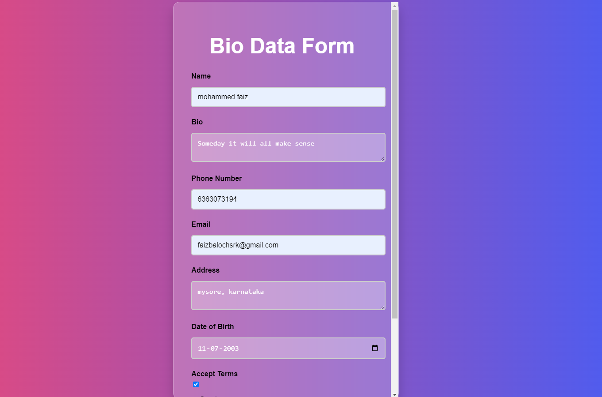
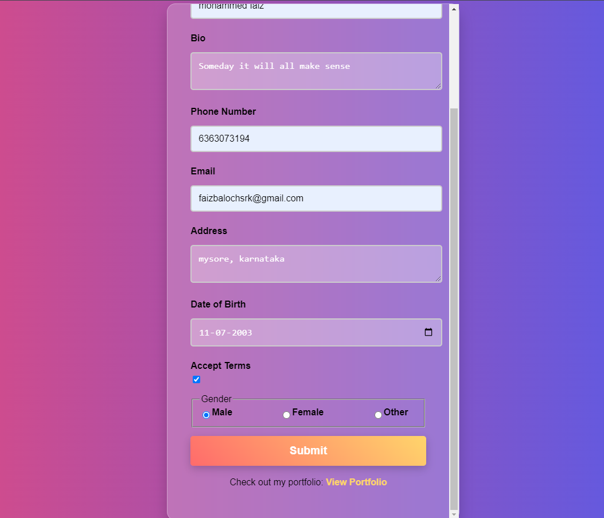
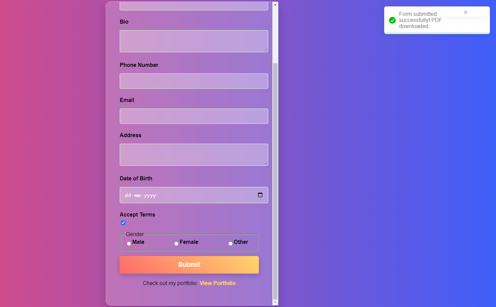

# Task 2: Shared Form Component

## Overview
This task involves creating a reusable form component that handles common input fields like **text**, **checkbox**, **textarea**, and **radio buttons**. It was designed to simplify form creation by making use of a single component for different input types.

## Features
- Reusable input component.
- Supports text, textarea, checkbox, and radio input fields.
- Validations applied to each field using **Yup** and **Formik**.

## Screenshots

### Form Example

## Technologies Used
- **React**
- **Formik**
- **Yup** (for form validation)

## Installation and Setup
1. Clone the repository.
2. Run `npm install` to install dependencies.
3. Start the app with `npm start`.

## How to Use
1. Import the shared `FormComponent` in your form.
2. Define the fields you need and pass them as props to the component.
3. The component handles validation and form submission.

## Files
- `FormComponent.js`: Contains the reusable form logic for different input types.
- `ValidationSchema.js`: Defines validation rules for form fields.

## Future Improvements
- Add support for more input types like file upload and date pickers.
